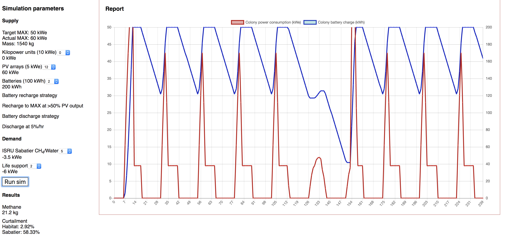

## Martian Colony Power Simulator

For an explanation, please see this [Twitter thread](https://twitter.com/redskyforge/status/984822985386229760).

To run yourself, clone the repository, run yarn install, then yarn start.

The project uses React (create-react-app) and chart.js.

